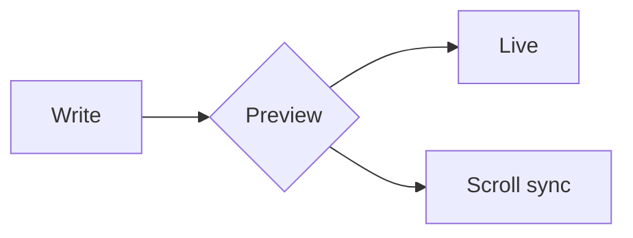

# Markdown Preview Online

A fast, browser-only Markdown editor with live preview. No backend, no sign-in — just open and write.

🔗 **Live demo:** [trongcong.github.io/markdown-preview-online](https://trongcong.github.io/markdown-preview-online/)

## Features

- **Live preview** — renders as you type
- **GitHub Flavored Markdown** — tables, checklists, strikethrough, task lists
- **Mermaid diagrams** — flowchart, sequence, class, Gantt, and more
  - Zoom modal with scroll-to-zoom, drag-to-pan, double-click to zoom in/out
  - Fit / 100% / +/- buttons, Download SVG
- **Syntax highlighting** — code blocks via highlight.js (atom-one-dark theme)
- **Markdown syntax in editor** — headings, bold, italic, links, inline code highlighted
- **Line numbers** — always visible in the editor gutter
- **Sync scroll** — editor and preview scroll together (toggleable)
- **Resizable split** — drag the divider to adjust editor/preview width
- **Multiple tabs** — create, rename (double-click), close tabs
- **Auto save** — all tabs persisted in `localStorage` and restored on refresh
- **Share via URL** — encode content in the URL hash and copy to clipboard
- **Layout modes** — Split / Editor only / Preview only
- **Responsive** — mobile toggle between editor and preview

## Tech stack

| Layer | Library |
|---|---|
| UI framework | React 19 + TypeScript |
| Bundler | Vite 8 |
| Styling | Tailwind CSS v3 + @tailwindcss/typography |
| Markdown | react-markdown + remark-gfm |
| Syntax highlight | rehype-highlight + highlight.js |
| Diagrams | mermaid |
| Editor | CodeMirror 6 (@uiw/react-codemirror) |
| URL compression | lz-string |

## Quick start

```bash
npm install
npm run dev
```

Then open [http://localhost:5173](http://localhost:5173).

## Keyboard shortcuts

| Key | Action |
|---|---|
| `Tab` | Indent (2 spaces) |
| `Shift+Tab` | Unindent |
| `Ctrl/Cmd+Z` | Undo |
| `Ctrl/Cmd+Shift+Z` | Redo |
| `Esc` | Close diagram zoom modal |

## Diagram zoom controls

| Interaction | Action |
|---|---|
| Scroll wheel | Zoom in / out toward cursor |
| Double-click | Zoom in 2× toward cursor |
| Shift + double-click | Zoom out 2× toward cursor |
| Drag | Pan the diagram |
| **Fit** button | Fit diagram to canvas |
| **100%** button | Fill full canvas width |

## Share via URL

Click the **Share** button in the toolbar — the current tab's content is compressed and encoded into the URL hash, and the link is copied to your clipboard. Anyone who opens the link gets a new **Shared** tab with the same content.

## Performance

The build is split into separate chunks so the browser caches each dependency independently and only downloads what it needs:

| Chunk | Size (gzip) | Loaded |
|---|---|---|
| App core | ~7 KB | Always |
| React | ~57 KB | Always |
| Markdown + highlight.js | ~99 KB | Always |
| CodeMirror editor | ~212 KB | Always |
| Mermaid diagrams | ~765 KB | **On demand** — only when a diagram block is encountered |

## Deploy

Pushes to `main` automatically build and deploy to GitHub Pages via GitHub Actions.

To enable: go to **Settings → Pages → Source → GitHub Actions** in your repository.

## Mermaid example

~~~markdown

~~~

Hover a rendered diagram to reveal **Zoom** and **Download SVG** buttons.
